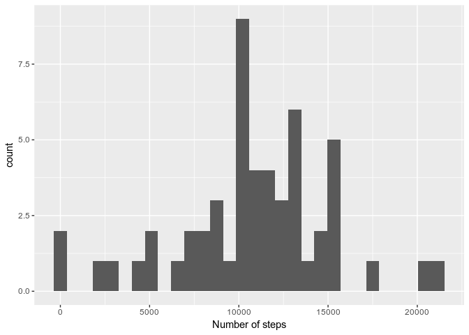
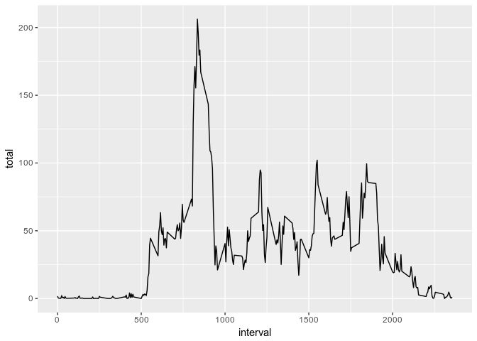
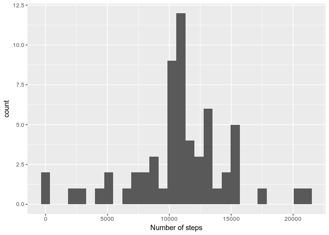
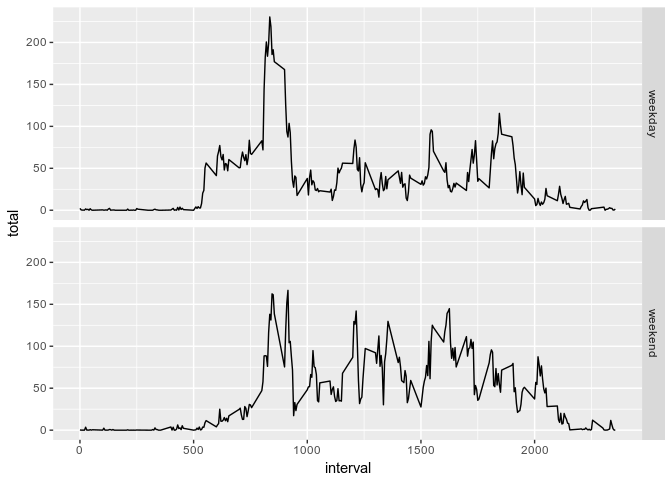

## Loading and preprocessing the data

### Loading library dplyr, ggplot2, caret

```r
library(dplyr)
```

```
## 
## Attaching package: 'dplyr'
```

```
## The following objects are masked from 'package:stats':
## 
##     filter, lag
```

```
## The following objects are masked from 'package:base':
## 
##     intersect, setdiff, setequal, union
```

```r
library(ggplot2)
```

### Dezipping activity.zip to obtain activity.csv

```r
zipF <- "activity.zip"
outDir <- "./"
unzip(zipF, exdir=outDir)
```

### Loading activity.csv and transforming date in Date format

```r
data <- read.csv("activity.csv", header = T, sep = ",")
data <- tbl_df(data)
data$date <- as.Date(data$date, format = "%Y-%m-%d")
```

## What is mean total number of steps taken per day?
### Creating a dataframe with the days and the number of steps by day and plot a histogram of the total number of steps taken each day

```r
stepsbyday <- data %>% group_by(date) %>% summarize(total = sum(steps))
qplot(stepsbyday$total, data = stepsbyday, geom = "histogram", xlab = "Number of steps")
```

```
## `stat_bin()` using `bins = 30`. Pick better value with `binwidth`.
```

```
## Warning: Removed 8 rows containing non-finite values (stat_bin).
```

<!-- -->

```r
dev.copy(png, file = "figure/plot1.png")
```

```
## png 
##   3
```

```r
dev.off()
```

```
## png 
##   2
```

### Mean of the total number of steps taken by day 

```r
print(mean(stepsbyday$total, na.rm = T))
```

```
## [1] 10766.19
```

### Median of the total number of steps taken by day

```r
print(median(stepsbyday$total, na.rm = T))
```

```
## [1] 10765
```

## What is the average daily activity pattern?
### Creating a dataframe with the 5-minute interval and the average number of steps taken, averaged across all days and plotting a time series plot

```r
stepsbyinterval <- data %>% group_by(interval) %>% summarize(total = mean(steps, na.rm=T))
ggplot(stepsbyinterval, aes(interval, total)) + 
        geom_path()
```

<!-- -->

```r
dev.copy(png, file = "figure/plot2.png")
```

```
## png 
##   3
```

```r
dev.off()
```

```
## png 
##   2
```

### Which 5-minute interval, on average across all the days in the dataset, contains the maximum number of steps?

```r
print(which(stepsbyinterval$total == max(stepsbyinterval$total, na.rm=T))[[1]])
```

```
## [1] 104
```

## Imputing missing values
### Total number of missing values in the dataset (i.e. the total number of rows with NAs)

```r
print(nrow(data %>% filter(is.na(steps))))
```

```
## [1] 2304
```

### Strategy for filling in all of the missing values in the dataset : we use the mean for that 5-minute interval and create a new dataset data2 that is equal to the original dataset but with the missing data filled in.

```r
data2 <- select(left_join(data, stepsbyinterval, by=c("interval"="interval")), steps, date, interval, total)
data2 <- data2 %>% mutate(steps=ifelse(is.na(steps), total, steps)) 
data2$total <- NULL
```

### Make a histogram of the total number of steps taken each day and Calculate and report the mean and median total number of steps taken per day

```r
stepsbyday2 <- data2 %>% group_by(date) %>% summarize(total = sum(steps))
qplot(stepsbyday2$total, data = stepsbyday2, geom = "histogram", xlab = "Number of steps")
```

```
## `stat_bin()` using `bins = 30`. Pick better value with `binwidth`.
```

<!-- -->

```r
dev.copy(png, file = "figure/plot3.png")
```

```
## png 
##   3
```

```r
dev.off()
```

```
## png 
##   2
```

### Mean of the total number of steps taken per day

```r
print(res <- mean(stepsbyday2$total, na.rm = T))
```

```
## [1] 10766.19
```

### Median of the total number of steps taken by day

```r
print(res <- median(stepsbyday2$total, na.rm = T))
```

```
## [1] 10766.19
```
## Are there differences in activity patterns between weekdays and weekends?
### Create a new factor variable (day) in the dataset with two levels – “weekday” and “weekend” indicating whether a given date is a weekday or weekend day

```r
data2$day <- weekdays(as.Date(data2$date))
weekday <- c("Monday", "Tuesday", "Wednesday", "Thursday", "Friday")
weekend <- c("Saturday", "Sunday")
data2 <- mutate(data2, day = factor(case_when(day %in% weekday ~ "weekday",
                                              day %in% weekend ~ "weekend")))
```

###Panel plot containing a time series plot (type="l") of the 5-minute interval (x-axis) and the average number of steps taken, averaged across all weekday days or weekend days (y-axis)

```r
stepsbyinterval2 <- data2 %>% group_by(interval, day) %>% summarize(total = mean(steps, na.rm=T))
ggplot(stepsbyinterval2, aes(interval, total)) + 
        geom_path() + 
        facet_grid(day~.)
```

<!-- -->

```r
dev.copy(png, file = "figure/plot4.png")
```

```
## png 
##   3
```

```r
dev.off()
```

```
## png 
##   2
```
